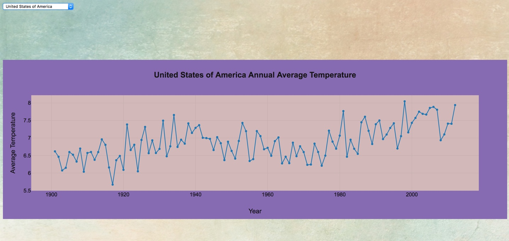

# VisualHeat
This application allows the end user to visualize average global temperature variations. The application presents data from 1900 to 2012.

## Motivation

The objective of the project is to utilize plotting data to present a visualization of the change in temperature over a period of time. Global temperature changes are a hot topic these days and some find themselves on opposite sides of the topic. Data is a scientific means for helping us to understand the topic.

## Usage

Navigate to [VisualHeat](https://sheltered-beach-15234.herokuapp.com/) in a browser. Site URL:
```
https://sheltered-beach-15234.herokuapp.com/
```

## Screenshots


## Technology Stack
- [Plotly.js](https://plot.ly/javascript/getting-started/)
- [Handlebars.js](https://handlebarsjs.com/)
- [MySQL](https://www.mysql.com/)
- [Heroku](www.heroku.com)

## Development Team

- Nelly Ackerman - <pavel.ack@gmail.com>
    - __Contributions:__ *MVC Structure, API Routes, Node.js* 
- Dennis Gayvoronsky - <Deniskag@gmail.com>
    - __Contributions:__ *MySQL, ORM*
- Alex Peralta - <alex.peralta.sr@gmail.com>
    - __Contributions:__ *Project Manager, Design, Node.js*

###### Data Sources
* [www.nationsonline.org](http://www.nationsonline.org/oneworld/country_code_list.htm)
* [www.ncdc.noaa.gov](https://www.ncdc.noaa.gov/cdo-web/datasets)
